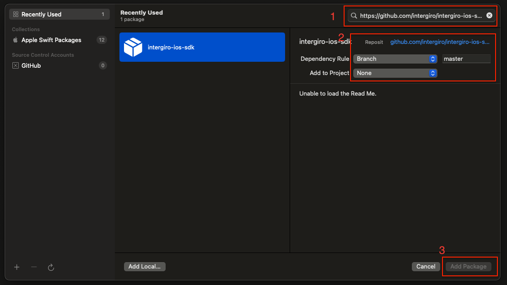
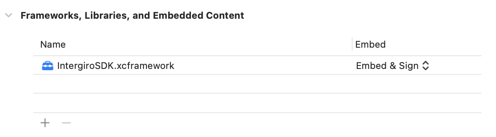

# Intergiro SDK for iOS

## Getting started

```swift
import IntergiroSDK

Intergiro.setPublicKey("<PUBLIC_KEY>")
```

### Apple Wallet extension

To add support for Wallet Extension it is needed to add two extensions to the App

 - UI extension for the Authentification process. You must do the auth process with `launch` method. 
```swift
Intergiro.launch(token: "<TOKEN>", completion: (([String: Any]?, Error?) -> Void)?)
```

- Non-UI extension to provide data for Wallet App. 
    - `status() async -> PKIssuerProvisioningExtensionStatus` method from `PKIssuerProvisioningExtensionHandler` should return `PKIssuerProvisioningExtensionStatus` that contains `requiresAuthentication = true`
    - Extension should redirect 3 methods to the SDK:
```swift
Intergiro.WalletExtension.passEntries() async -> Result<[PKIssuerProvisioningExtensionPaymentPassEntry], IntergiroError>
Intergiro.WalletExtension.remotePassEntries() async -> Result<[PKIssuerProvisioningExtensionPaymentPassEntry], IntergiroError>
Intergiro.WalletExtension.generateAddPaymentPassRequestForPassEntryWithIdentifier(
    _ identifier: String,
    configuration: PKAddPaymentPassRequestConfiguration,
    certificateChain certificates: [Data],
    nonce: Data,
    nonceSignature: Data
) async -> Result<PKAddPaymentPassRequest?, IntergiroError>
```
They are written with async/await approach, but also have analogs with completion block

## Installation

### Swift Package Manager

Add a package by selecting `File` → `Add Packages…` in Xcode’s menu bar.
Search for the IntergiroSDK using the repo's URL:
```console
https://github.com/intergiro/ios-sdk.git
```



#### Alternative

To integrate via a `Package.swift` manifest instead of Xcode, you can add
IntergiroSDK to the dependencies array of your package:

```swift
dependencies: [
  .package(
    name: "IntergiroSDK",
    url: "https://github.com/intergiro/ios-sdk.git"
  ),

  // Any other dependencies you have...
],
```

Then, in any target that depends on a IntergiroSDK product, add it to the `dependencies`
array of that target:

```swift
.target(
  name: "MyTargetName",
  dependencies: [
    .product(name: "IntergiroSDK", package: "IntergiroSDK"),
  ]
),
```

### Cocoapods

Add to `Podfile`
```
pod 'IntergiroSDK'
```

### Manual

1. Download the latest version of the SDK
2. Open the General settings in your Xcode project
3. Drag & Drop **IntergiroSDK.xcframework** to the **Frameworks, Libraries and Embedded Content** section (select **Copy items if needed** during copying)
4. Make sure option **Embed & Sign** is selected



## Requirements
The Intergiro iOS SDK is compatible with apps targeting iOS 13 or above.

## Credits
 - [WKWebViewJavascriptBridge](https://github.com/Lision/WKWebViewJavascriptBridge)
 - [PanModal](https://github.com/slackhq/PanModal)

## License

Intergiro iOS SDK is released under the [MIT license](LICENSE.md).
